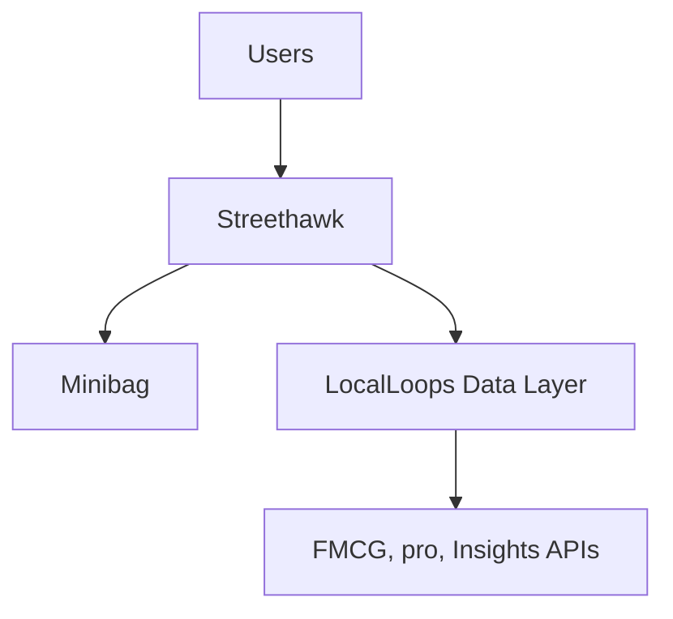
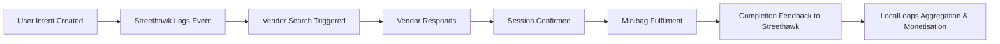

## 🦅 Streethawk Architecture — Unified Model (v2)

**Updated:** October 2025  
**Parent App:** LocalLoops  
**Partner App:** Minibag  

---

### 🧭 1. Role & Positioning

**Streethawk** is the **coordination and intelligence engine** for neighborhood commerce within the LocalLoops ecosystem.  
It sits between **user intent** (social coordination) and **transaction fulfillment** (Minibag), serving as the *single source of truth* for both **user-side coordination** and **vendor-side response intelligence**.

| Layer | Function | Feeds Into |
|:--|:--|:--|
| **User Coordination Layer** | Session planning, invites, intent capture | LocalLoops analytics, Minibag linkage |
| **Vendor Intelligence Layer** | Vendor registration, response tracking, performance metrics | Pro dashboard, predictive APIs |
| **LocalLoops Aggregation Layer** | Data monetisation, neighborhood analytics | Enterprise insights, FMCG APIs |

---

### 🧩 2. App Relationships

- **Parent Relationship:** Streethawk operates as a *child app to LocalLoops*, using its event bus and data standards.  
- **Partner Relationship:** Streethawk and Minibag share linked session IDs and intent references.

---

### ⚙️ 3. Functional Overview

#### **A. Session Creation Flow**
1. **Host initiates a session** — defines time window, location, and purpose (e.g., grocery run, shared errand).  
2. **Chooses mode:**  
   - *Friends-only*: purely social coordination, no vendor involvement.  
   - *Vendor-assisted*: seeks a vendor to join the session.  
3. **Invites participants** (friends or family) through in-app link or contact list.  
4. **If vendor-assisted:** Streethawk auto-triggers vendor search logic.

#### **B. Vendor Search & Response Flow**
- Vendors registered in Streethawk receive real-time requests based on category, radius, and availability.
- Vendors can **accept, decline, or modify time**.  
- Streethawk logs:
  - `response_time_sec`
  - `response_status`
  - `cluster_success_rate`
  - `avg_delay_min`
- Accepted vendors are mapped to the session, and the intent is upgraded to a Minibag transaction link.

#### **C. Session Completion & Feedback**
- Once the Minibag order is fulfilled, the session closes with:
  - `completion_rating`
  - `vendor_feedback`
  - `user_reliability_score`

All completion data syncs back into Streethawk for behavioral and performance analytics.

---

### 🧠 4. Data Architecture

#### **Core Tables**

| Table | Function | Key Fields |
|:--|:--|:--|
| `pre_demand_events` | Captures session intent | `intent_id`, `host_id`, `scheduled_time`, `urgency_score`, `participants_invited`, `vendor_requested` |
| `vendor_profiles` | Vendor registry | `vendor_id`, `category`, `service_radius_km`, `availability_window`, `reliability_score` |
| `vendor_responses` | Vendor interactions | `intent_id`, `vendor_id`, `response_status`, `response_time_sec`, `notes` |
| `vendor_metrics_daily` | Aggregated metrics | `vendor_id`, `date`, `accepted_count`, `avg_response_time`, `cluster_success_rate` |

---

### 🔁 5. Event Flow Integration

Each event is timestamped and streamed into LocalLoops’ warehouse via webhooks for aggregation and monetisation (predictive APIs, vendor analytics, and coordination indices).

---

### 💼 6. Pro Module (Streethawk Internal)

A subscription feature within Streethawk for vendors to:
- View **demand hotspots** from nearby intents.  
- Track **daily response metrics** and customer retention.  
- Access **route optimization** for multiple neighborhood requests.  
- Compare **cluster performance** vs peer benchmarks.  

**Pricing:** ₹200–₹500/month (tiered based on usage).

---

### 📊 7. Data Exchange with LocalLoops

| Direction | Source | Destination | Purpose |
|:--|:--|:--|:--|
| **Outbound** | Streethawk → LocalLoops | Raw event streams | Intent, vendor responses, completions |
| **Inbound** | LocalLoops → Streethawk | Predictive model outputs | Vendor reliability score, demand forecast hints |

This two-way loop allows LocalLoops to enrich Streethawk with predictive scoring while maintaining Streethawk as the *operational truth source*.

---

### 🧮 8. Monetisation Interfaces

| Product | Source | Buyer | Description |
|:--|:--|:--|:--|
| **Predictive Demand Heatmap** | Streethawk intent data | Vendors, logistics | Maps pre-demand activity |
| **Vendor Reliability API** | Streethawk vendor metrics | Fintech, marketplaces | Provides credit-like vendor scores |
| **Neighborhood Coordination Index** | Streethawk invites & responses | FMCG, civic bodies | Measures community commerce density |
| **Pro Dashboard** | Streethawk data service | Individual vendors | Paid analytics panel |

---

### 🔐 9. Privacy & Data Governance

- All user and vendor identifiers are hashed.  
- Vendor analytics shown only above minimum threshold (e.g., >5 sessions/week).  
- No raw personal data leaves Streethawk.  
- LocalLoops handles aggregation, anonymisation, and monetised exports.

---

### 🚀 10. Technical Stack Summary

| Component | Tech | Notes |
|:--|:--|:--|
| Frontend | React Native / Flutter | Unified UI for users and vendors |
| Backend | Node.js / Go microservices | Event-driven design, Kafka or Pub/Sub integration |
| Database | PostgreSQL + TimescaleDB | Handles time-series vendor metrics |
| Analytics | LocalLoops Data Warehouse (BigQuery / ClickHouse) | Aggregated monetisation layer |

---

### ✅ 11. Key Principles

1. **Single Source of Truth:** All coordination and vendor intelligence live within Streethawk.  
2. **Two-Way Intelligence:** LocalLoops enriches Streethawk; Streethawk feeds LocalLoops.  
3. **Event-Driven Everything:** Real-time, auditable event logs replace batch syncs.  
4. **Privacy by Design:** No direct user–vendor identifiers ever exposed.  
5. **Monetisation Built-In:** Streethawk’s operational data fuels LocalLoops’ analytics and vendor subscriptions.

---

### 🧩 Summary

Streethawk is now **the operational and analytical core** of LocalLoops’ neighborhood commerce loop.  
It captures *how people plan*, *how vendors respond*, and *how community commerce functions*, enabling LocalLoops to monetise these insights as predictive APIs, dashboards, and neighborhood intelligence products.

